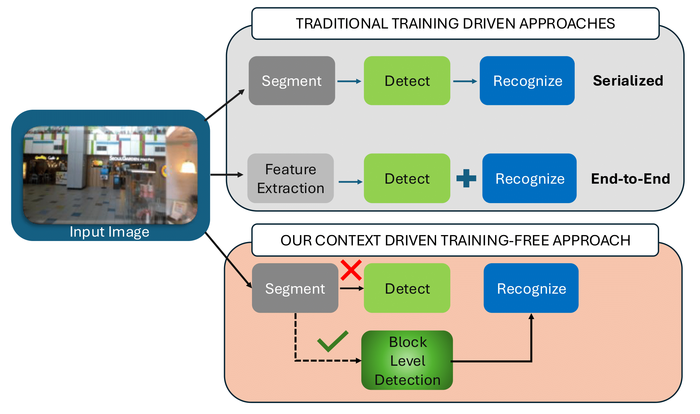
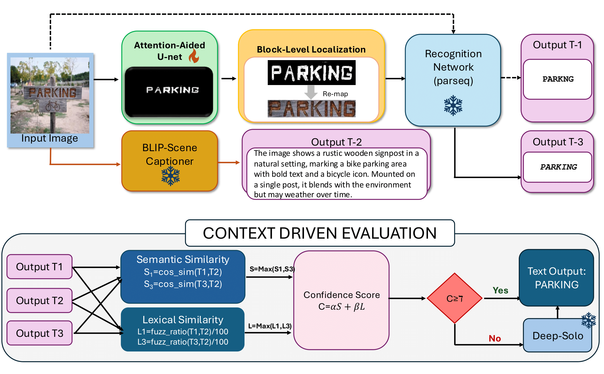

# A Lightweight Context-Driven Training-Free Network for Scene Text Segmentation and Recognition

[](https://icdar2025.org/)
[](https://arxiv.org/abs/2503.15639)
[](https://ritabrata04.github.io/Context-driven-STR/)
[](#)
[](#license)

**Ritabrata Chakraborty**¹ ²
<a href="https://orcid.org/0009-0009-3597-3703"></a> †,
**Palaiahnakote Shivakumara**³
<a href="https://orcid.org/0000-0001-9026-4613"></a>,
**Umapada Pal**¹
<a href="https://orcid.org/0000-0002-5426-2618"></a>,
**Cheng-Lin Liu**⁴
<a href="https://orcid.org/0000-0002-6743-4175"></a>

¹ CVPR Unit, Indian Statistical Institute, Kolkata, India &nbsp;•&nbsp; <a href="mailto:umapada@isical.ac.in">umapada@isical.ac.in</a>  

² Manipal University Jaipur, India &nbsp;•&nbsp; <a href="mailto:ritabrata.229301716@muj.manipal.edu">ritabrata.229301716@muj.manipal.edu</a>  

³ University of Salford, UK &nbsp;•&nbsp; <a href="mailto:s.palaiahnakote@salford.ac.uk">s.palaiahnakote@salford.ac.uk</a>  

⁴ School of Artificial Intelligence, University of Chinese Academy of Sciences (UCAS), China &nbsp;•&nbsp; <a href="mailto:liucl@nlpr.ia.ac.cn">liucl@nlpr.ia.ac.cn</a>  


† <em>Work done during internship at ISI Kolkata.</em>

> **ICDAR 2025 Oral (Top ~40 accepted)** — A training-free, **context-driven** pipeline for **scene text segmentation & recognition** that avoids heavy end-to-end text spotters unless necessary. We combine a lightweight **AG-UNet** (attention-gated U-Net) for text foreground masks, **block-level localization**, **BLIP-2 scene captions** for semantic context, efficient **recognizers** (e.g., TrOCR/PARSeq), and a simple **semantic+lexical fusion** to decide whether a **heavy fallback** (DeepSolo) is needed.

---

<p align="center">
  
</p>

## 🔥 Abstract 

Modern scene text recognition systems often depend on large end-to-end architectures that require extensive training and are prohibitively expensive for real-time scenarios. In such cases, the deployment of heavy models becomes impractical due to constraints on memory, computational resources, and latency. To address these challenges, we propose a novel, training-free plug-and-play framework that leverages the strengths of pre-trained text recognizers while minimizing redundant computations. Our approach uses context-based understanding and introduces an attention-based segmentation stage, which refines candidate text regions at the pixel level, improving downstream recognition. Instead of performing traditional text detection that follows a block-level comparison between feature map and source image and harnesses contextual information using pretrained captioners, allowing the framework to generate word predictions directly from scene context. Candidate texts are semantically and lexically evaluated to get a final score. Predictions that meet or exceed a pre-defined confidence threshold bypass the heavier process of end-to-end text STR profiling, ensuring faster inference and cutting down on unnecessary computations. Experiments on public benchmarks demonstrate that our paradigm achieves performance on par with state-of-the-art systems, yet requires substantially fewer resources.

---

## 🏗️ Method Overview

<p align="center">
  <em>Architecture: AG-UNet → Mask → Blocks → (T1, T3, T2) → Scoring → Decision (Bypass vs. DeepSolo)</em>
</p>

<p align="center">
  
</p>

- **Segmentation (AG-UNet)**: ResNet-50 encoder + attention-gated skips + BN bottleneck → foreground <strong>probability map</strong> → <strong>binary mask</strong>.
- **Localization**: Connected components on the mask → padded bboxes → top-K <strong>blocks</strong>.
- **Context (T2)**: BLIP-2 caption with a “text-aware” prompt → <strong>medium-length</strong> description (~40–80 tokens).
- **Recognition**: T1 on the full image; T3 on block crops (choose best crop by scoring).
- **Scoring**: MPNet cosine <strong>S1/S3</strong> + Levenshtein <strong>L1/L3</strong> → <strong>C = αS + βL</strong>; if <code>max(C1,C3) ≥ τ</code>, return the <strong>semantically stronger</strong> (higher S) between T1/T3; else <strong>fallback</strong>.
- **Fallback**: Optional <strong>DeepSolo/MMOCR</strong> call only when needed.


---

## 📦 Installation

<strong>Python 3.10+</strong> recommended.

```bash
git clone https://github.com/Ritabrata04/icdar2025-context-driven-str.git
cd icdar2025-context-driven-str
python -m venv .venv && source .venv/bin/activate
pip install --upgrade pip
pip install -r requirements.txt
```

- <strong>HuggingFace</strong> weights (BLIP-2, MPNet, TrOCR) will download on first use to your HF cache: <code>~/.cache/huggingface/</code>.  
- <strong>GPU</strong> is recommended (set <code>device: cuda</code> in configs). CPU works but is slow for BLIP-2.

---

## ⚙️ Minimal Configs (create these files)

This repo’s CLI expects a base config and a run preset. Create the following:

**`configs/default.yaml`**
```yaml
seed: 1337
device: "cuda"
num_workers: 4
deterministic: true

segmenter:
  ckpt: ""              # path to AdvancedUNet checkpoint (optional but recommended)
  input_size: [256, 256]
  binarize_thresh: 0.5

localize:
  min_area: 150         # Amin
  pad: 6                # p
  nmax: 10              # max blocks per image

recognition:
  device: "cuda"
  models: ["trocr"]     # choose from: trocr, tesseract, parseq, dummy
  trocr:
    repo_id: "microsoft/trocr-base-printed"
    revision: null
  tesseract:
    lang: "eng"

caption:
  model: "Salesforce/blip2-flan-t5-xl"
  max_len: 80
  min_len: 40

scoring:
  embedder: "sentence-transformers/all-mpnet-base-v2"
  alpha: 0.6
  beta: 0.4
  tau: 0.8

fallback:
  use_deepsolo: false   # set true only if you integrate MMOCR/DeepSolo
  only_if_below_tau: true
```

**`configs/run_presets/demo_folder.yaml`**
```yaml
# Example override for a quick folder demo
device: "cuda"

segmenter:
  ckpt: ""             # optional; if left empty, mask quality will be poor

localize:
  min_area: 150
  pad: 6
  nmax: 5

recognition:
  models: ["trocr"]
  device: "cuda"

caption:
  model: "Salesforce/blip2-flan-t5-xl"
  max_len: 80
  min_len: 40

scoring:
  embedder: "sentence-transformers/all-mpnet-base-v2"
  alpha: 0.6
  beta: 0.4
  tau: 0.8

fallback:
  use_deepsolo: false
```


---

## 📜 Citation

```bibtex
@inproceedings{Chakraborty2025ContextDrivenSTR,
  title     = {A Lightweight Context-Driven Training-Free Network for Scene Text Segmentation and Recognition},
  author    = {Chakraborty, Ritabrata and Shivakumara, Palaiahnakote and Pal, Umapada and Liu, Cheng-Lin},
  booktitle = {Proceedings of the International Conference on Document Analysis and Recognition (ICDAR)},
  year      = {2025},
  note      = {Oral},
  eprint    = {arXiv:2503.15639},
  url       = {https://arxiv.org/abs/2503.15639}
}
```

---

## 🪪 License

This repository is released under the <strong>MIT License</strong> (add a <code>LICENSE</code> file if not present).  
© 2025 The authors. All rights reserved where applicable.
